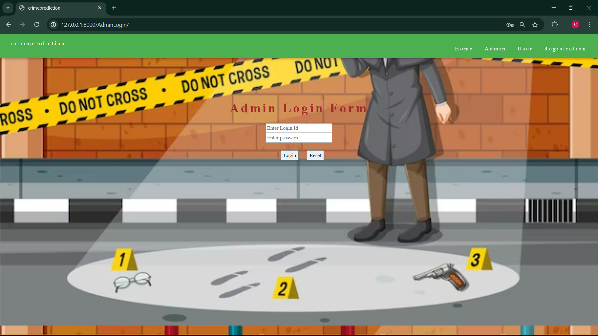
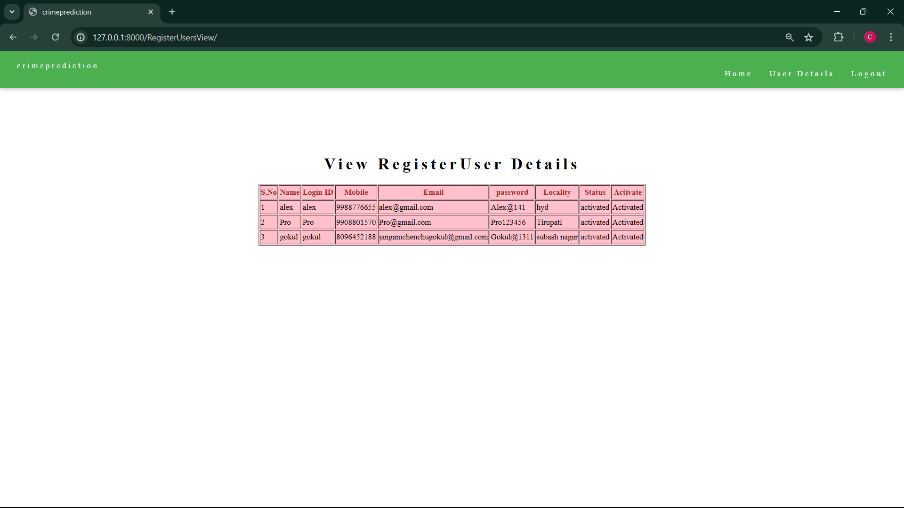
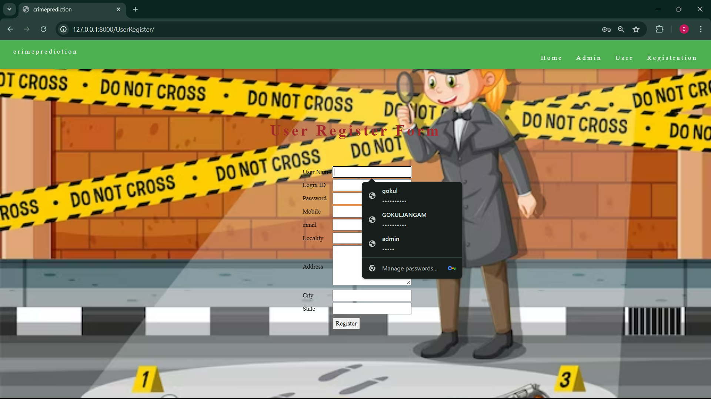

# Crime Prediction Through Machine Learning

## Project Abstract
Offering a predictive approach for crime occurrences in urban areas by integrating historical events and demographic data into a machine learning framework at the network edge, addressing public safety concerns.

## Table of Contents
1. [Introduction](#introduction)
2. [Data Description](#data-description)
3. [Project Structure](#project-structure)
4. [Installation](#installation)
5. [Machine Learning](#machine-learning)
6. [Algorithms](#algorithms)
7. [Output](#output)

## Introduction
- **Pattern Identification**: Preventing crimes requires pattern identification.
- **Techniques**: Analytical techniques powered by Machine Learning can help officers identify crimes that are most likely to occur. This project forecasts crime occurrences using three algorithms:
  - K-Nearest Neighbor Classifier (KNN)
  - Multi-Layer Perceptron (MLP)
  - Random Forest Regression (We found the random forest model performs the best).
- **Law Enforcement**: Machine Learning algorithms support law enforcement by determining high-risk locations.
- **Predictive Policing**: Innovative approach that empowers law enforcement to enhance public safety measures.

## Data Description
We use crime data categorized by:
- Locations where crimes occurred
- Type of crime
- Crime data

## Project Structure
- **Home**
- **Admin**
  - Admin Login
  - Activate/Deactivate Users
  - View Overall Data
  - Manage User Account
- **User**
  - User Login
  - User Home
  - User Registration
  - Admin Activation
- **Crime Data**
- [**Machine Learning Model Training**](#machine-learning)
  - Crime Data
  - Model Training
  - Training Results
- **Crime Prediction**
  - Input
  - Output

## Installation
- **Install Django**
  - `pip install django`
- **Installing requirements.txt**
  - `pip install -r requirements.txt`
    - Use the above command to install the packages listed in the requirements file.
- **Runserver**
  - `py manage.py runserver`
    - Use the above command to start the server.

## Crime Data
- Data Collection
- Data Preprocessing
  - Imputing missing values
  - Normalizing and scaling features
  - Encoding categorical variables

## Machine Learning
- **Crime Data Analysis**
  - Data Preprocessing
    - Imputing missing values
    - Normalizing and scaling features
    - Encoding categorical variables
- **Model Training**
  - Splitting the data into training and test sets
  - Training each model on the training set using:
    - Random Forest Classifier
    - Multi-Layer Perceptron (MLP) Classifier
    - K-Nearest Neighbors Model (KNN)
  - Saving the trained models
- **Model Testing**
  - Using the testing dataset to evaluate:
    - Accuracy
    - Recall
    - Precision
    - F1 Score
    - Confusion Matrix

  
  
  

## Algorithms
- **K-Nearest Neighbor Classifier (KNN)**
  - An algorithm that classifies data points based on the majority class of their nearest neighbors in the feature space.
  - **Application in Project**:
    - KNN is utilized to classify crime occurrences based on their similarity to historical events, categorizing new instances based on their similarity to nearby data points.
- **Random Forest Classifier**
  - An algorithm that constructs multiple decision trees and combines their predictions to improve accuracy and robustness.
  - **Application in Project**:
    - Enhances accuracy by leveraging its ability to handle large datasets. Each tree in the forest independently classifies crime data, and the final prediction is based on a majority vote.
- **Multi-Layer Perceptron (MLP)**
  - Refers to a neural network that uses a Multi-Layer Perceptron Classifier. It contains input and output layers connected by multiple hidden layers, allowing for complex pattern recognition.
  - **Application in Project**:
    - By utilizing neural networks, we can capture nonlinear relationships and make accurate predictions about future criminal activities.

## Crime Prediction
- Using the given data input, the system predicts whether a crime will occur:
  - There is a crime
  - There is no crime

## Output
- Home page
  
- Admin page
  
  
  
- User page
  
  
- User registration
  
- crime prediction
  - If there is crime by data given
    
    
  - If there is crime by data given
    
    
