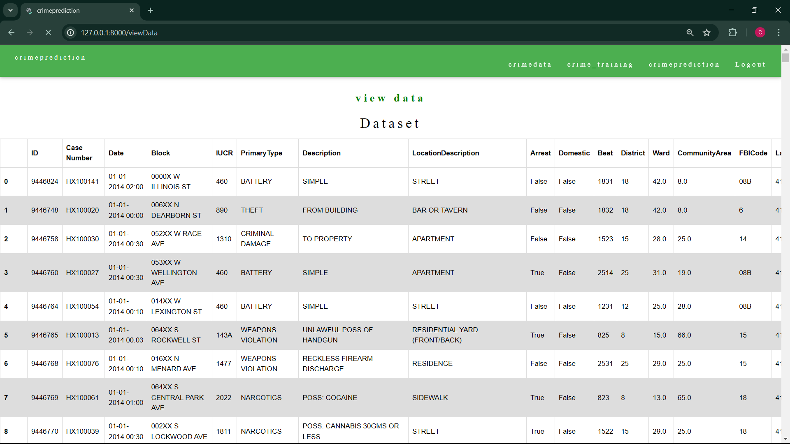
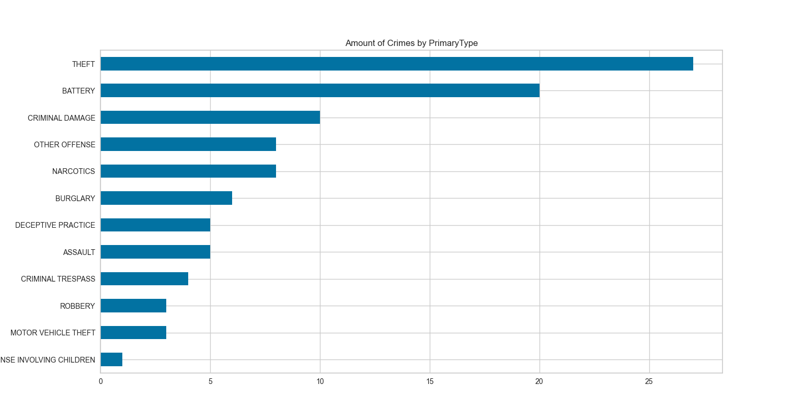
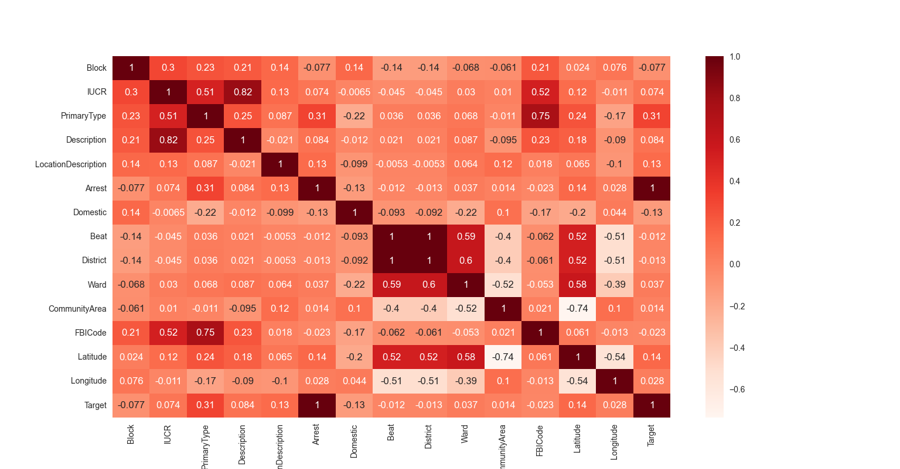
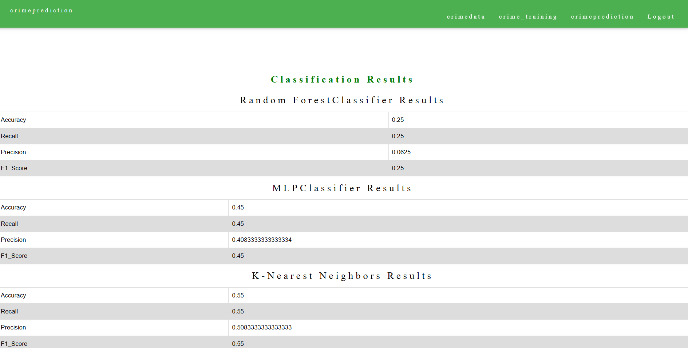
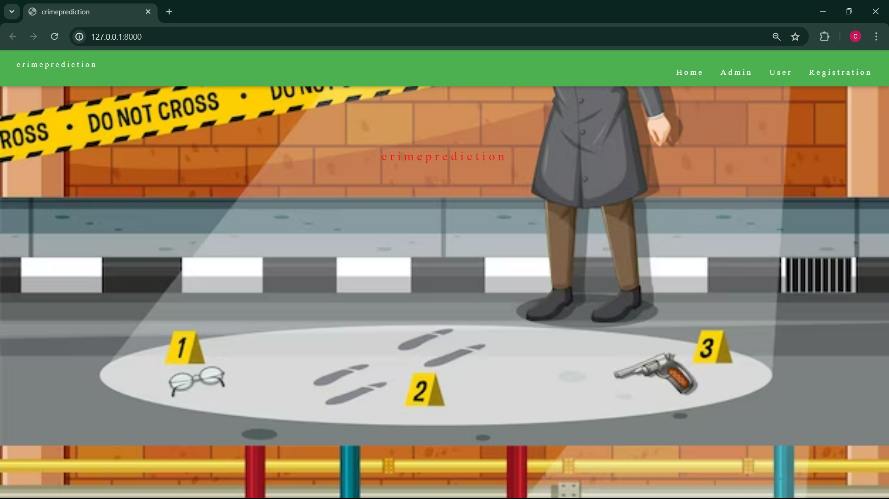
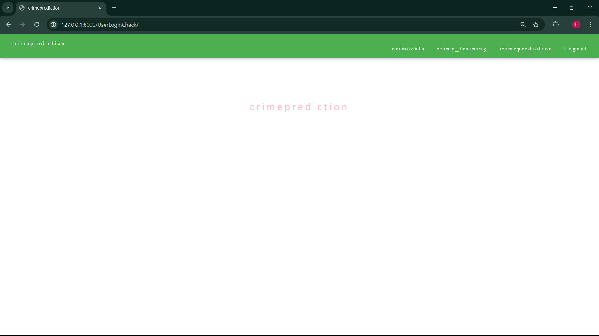
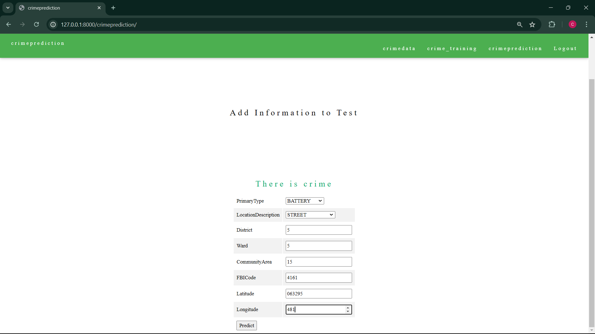
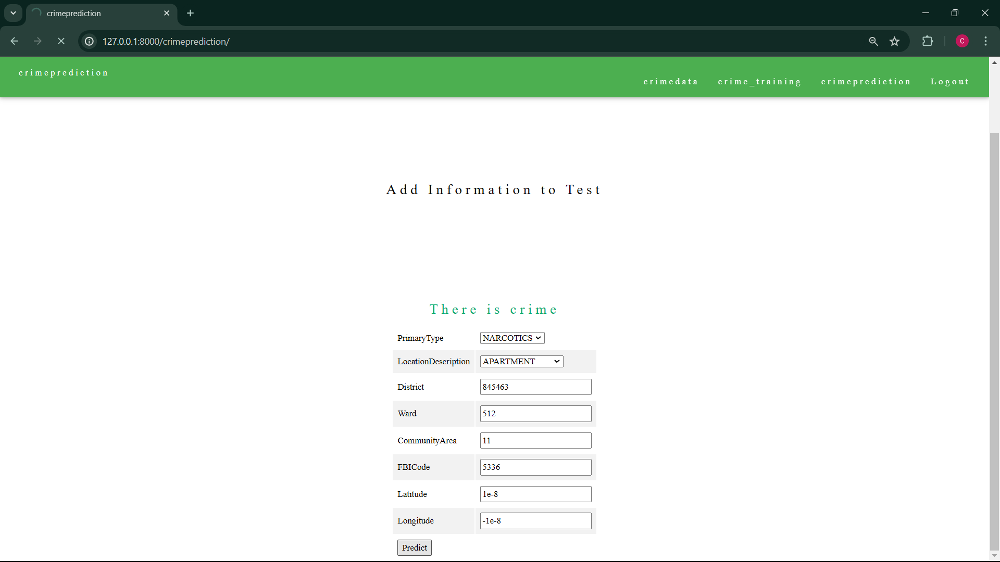
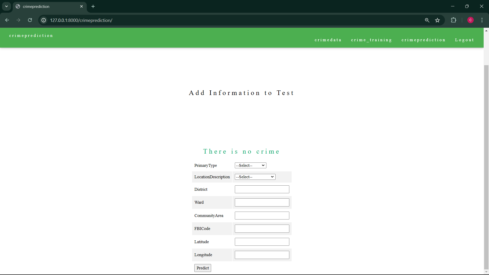

# Crime Prediction Through Machine Learning

## Project Abstract
Offering a predictive approach for crime occurrences in urban areas by integrating historical events and demographic data into a machine learning framework at the network edge, addressing public safety concerns.
## Table of Content
1. [Introduction](#Introduction)
2. [Data Description](#Data-description)
3. [Project Structure](#Project-structure)
4. [Installation](#Installation)
5. [Machine learning](#ML)
6. [Algorithms](#Algorithms)
7. [Output](#Output)

## Introduction
- PATTERN IDENTIFICATION : Preventing crimes requires pattern identification.
- TECHNIQUES : Analytical techniques powered by Machine Learning can helps officers  to identify crimes that most likely to occur.This project Forecasts cancer death cases in India using three algorithms: 
  - K- Nearest Neighbor Classifier (KNN)
  - Multi Layer perceptron (MLP)
  - random forest regression(We found the random forest model performs the best).
- LAW ENFORCEMENT : Machine Learning algorithms support law enforcement by determining high risk locations.
- PREDICTIVE POLICING : Innovative approach that empowers law enforcement to enhance public safety measure

## Data Description
We use cancer death case data from the Global Burden of Disease Study, covering the years 1990 to 2017. The data is categorized by:
- locations where crime occured
- Type of crime
- crime data

## Project structure
- Home
- Admin
  - Admin Login
  - Activate/Deactivate Users
  - View Overall Data
  - Manage User Account
- User
  - User Login
  - User Home
  - User Registration
  - Admin Activation
- Crime data 
- [Machine Learning Model Training](#ML)
  - Crime Data
  - Model Training
  - Training Results
- crime prediction
  - input
  - output

## Installation
- install django
  - pip install django
- installing requirements.txt
  - pip install -r requirements.txt
    - use the above command to install the packages listed in the requirements file.
- runserver
  - py manage.py runserver
    - use the above command to runserver

## Crime Data
- data collection
- data preprocessing
- Imputing missing values
- Normalizing and scaling features
- Encoding categorical variables

## ML
- Crime Data Analysis
  - Data Preprocessing
  - Imputing missing values
  - Normalizing and scaling features
  - Encoding categorical variables
- Model Training
  - Splitting the data into training and test sets
  - Training each model on the training set by algoriths
    - Random Forest Classifier
    - Multi-Layer Perceptron(mlp) Classifier
    - K-Nearest Neighbors Model (KNN)
  - Saving the trained models by x1 ansd x2 variables
- Model Testing
  -  the testing dataset by the target y variable
  -  calculated:
    - accuracy
    - recall
    - precision
    - F1 score
    - confusion matrix
  
  
  

## Algorithms
- K- Nearest Neighbor Classifier (KNN)
  - Algorithm that classifiers data points based one the majority class of  their nearest neighbors in the feature space.
  - Application in Project :
    - KNN is utilized to classify crime occurrences based on their similarity to historical events. Categorizing new instance based on their similarity to nearby data points.
- Random Forest Classifier
  - Algorithm that constructs multiple decision trees and combines their predictions to improve accuracy and robustness.
  - Application in Project :
    - Enhance accuracy by leveraging its ability to handle large datasets, each tree in the forest independently classifies crime data and final prediction based on majority vote.
- Multi Layer perceptron (MLP)
  - Refers  to a Neural network that uses Multi-layer Perceptron Classifier. It contains input and output layers connected by multiple hidden layers, allowing for complex pattern recognition.
  - Application in Project :
    - By utilizing neural networks, we can capture nonlinear relationship and make accurate predictions about future criminal activities.

## crime Prediction
  - by using the given data input the system shows the crime happened or not
    - there is crime
    - there is no crime

## results
- Home page
  - 
- Admin page
  - 
  - 
  - 
- User page
  - 
  - 
- If there is crime by data given
  - 
  - 
- If there is crime by data given
  - 
  - 
